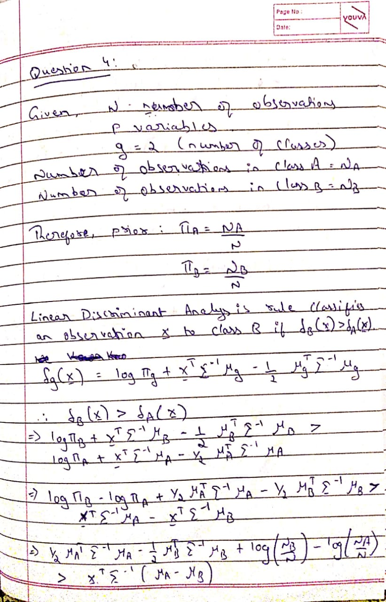
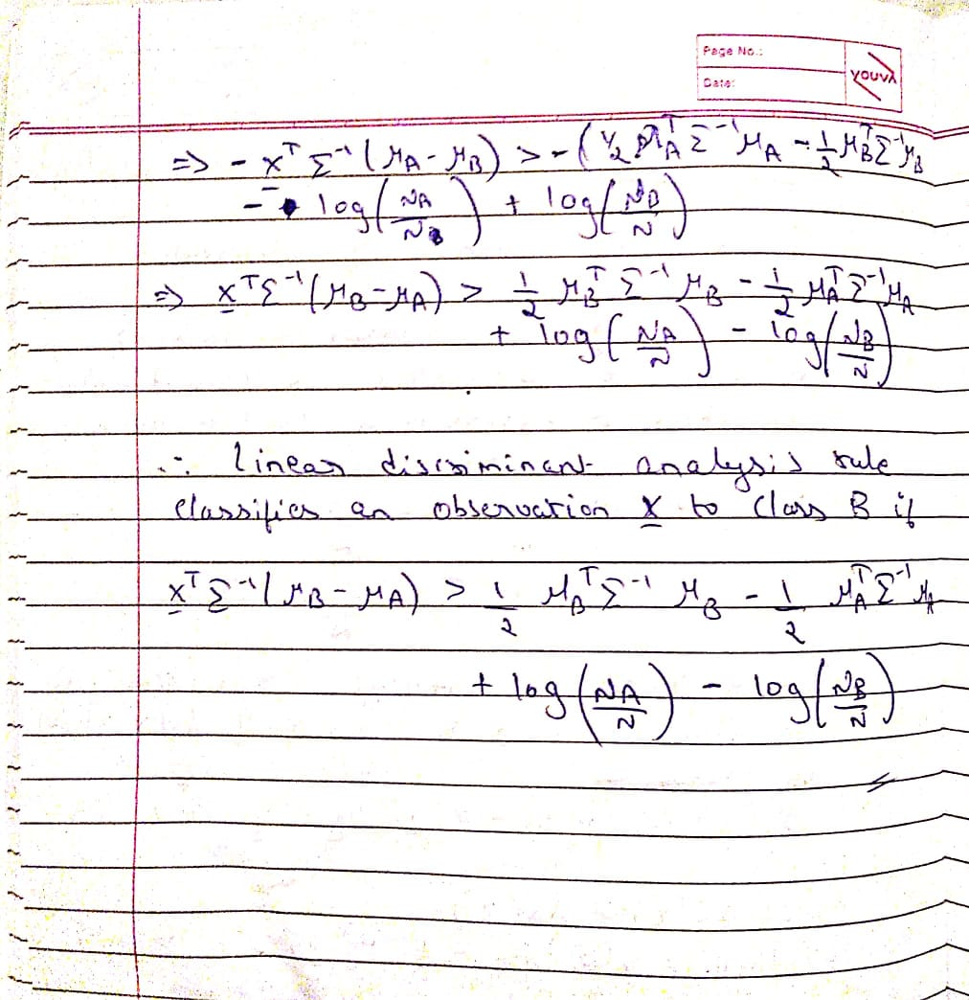

---

output: rmarkdown::github_document
---

##All the exaplaination are provided in the form of comments.


## Data cleaning by removing the observartion that is generated randomly. 


```{r setup}

set.seed(1820053) #Setting seed for particular Student Id so that when we re-run the same program multiple times the random number generated once will remain same even though we run the program multiple times.

num = as.integer(runif(1,1,45)) #Generating the a random number.

Pdata_original = read.csv("PotteryData.csv") #reading the data from csv file.


Pdata_test <- Pdata_original[-c(num), ] #Deleting an observation 

Pdata <- Pdata_test[, -c(10)] #removing column 9 from data


nrow(Pdata)
ncol(Pdata) #9 col because we have excluded the column 9

```

##Question 1:

## 1 (a) (i) :  Using R, calculate the covariance matrix Σ for the nine chemicals.

"cov"" command is used to generate the covariance of nine chemicals.

```{r}
cov(Pdata) #cov command is used to calculate the covariance of the data which has nine chemicals.
```


## 1 (a) (ii) : Using R, what are the first two eigenvalues and eigenvectors of Σ? Using R, show that they are indeed eigenvalues and eigenvectors of Σ.

```{r}

EigenValues = eigen(cov(Pdata))$values[1:2] ## First 2 eigen values of covariance matrix. Command used is eigen(matrix)$values to get the eigen values the matrix. Since eigen(matrix)$values generates a list of eigen values of the matrix we are using eigen(matrix)$values[1:2] to get the first 2 eigen values. 
EigenVectors = eigen(cov(Pdata))$vectors[,1:2]## First 2 eigen vectors of covariance matrix. Command used is eigen(matrix)$vectors to get the eigen vectors of the matrix. Since eigen(matrix)$vectors generates a matrix of eigen vectors of the matrix we are using eigen(matrix)$vectors[,1:2] to get the first 2 eigen vectors corresponding to first 2 eigen values.

#Below we are checking for whether the above generated eigen values and eigen vectors are indeed eigen values and vectors of covariace matrix that was generated above. 

if((sum(round(EigenValues[1] * EigenVectors[,1],digits = 3) == round(cov(Pdata) %*% EigenVectors[,1],digits = 3))) ==9 && (sum(round(EigenValues[2] * EigenVectors[,2],digits = 3) == round(cov(Pdata) %*% EigenVectors[,2],digits = 3))) == 9)
{

"Generated eigen values and vectors are indeed eigen values and eigen vectors of covariance matrix"

}


#In the above if condition we are just performing the basic rule lambda*x = A*x.Doing this generates a vector of length 9 with values TRUE for particular chemical.Summing up the vector to find if all the 9 chemicals have value TRUE and comparing it with 9 as there are 9 chemicals.  


EigenValues #First 2 eigen values
EigenVectors #First 2 eigen vectors


```

## 1 (a) (iii) :  Using R, verify that the first two eigenvectors are orthonormal
```{r}

zapsmall(crossprod(EigenVectors)) # General rule for orthonormal vectors is that cross product of vectors is an identity matrix. So here we are performing cross product of vectors and then using zapsmall function(since the non-diagonal elements of the obtained matrix which has slightly close to 0 are zapped/treated as 0) Thus generating identity matrix proves that Eigenvectors are orthonormal. 

```

##1 (a) (iv) :  Would you advise standardizing the pottery data prior to analysis? Explain your reasoning.


We are performing the data standardization because we see that in data matrix column 1(AI2O3 chemical) values are almost 1000 times the column 9(BaO), we dont want the our predictions/algorithm to be influenced more by particular one variable so we are performing data standardization so the all the variables are equally contributing in our future prediction.
```{r}

StDev = apply(Pdata, 2, sd) #apply function is used to apply particular function on row/columns respectively. Here we are using apply function to generate the standard deviation of each of the nine column and generate a vector containing the standard deviation of each of nine columns. 
Pdata = sweep(Pdata, 2, StDev, "/") #Sweep is used to divide each column in our data matrix by its standard deviation.

```

##1 (b) (i) : Suppose E[X1] = 10 and V ar[X1] = 11. Suppose E[X2] = 8 and V ar[X2] = 14. Suppose also that the covariance between X1 and X2 is 2.In R, calculate the expected value and variance of X1 − X2.


```{r}

Ex1 = 10 #Expected value of x1(mean of x1)
Ex2 = 8 #Expected value of x2(mean of x2)
varx1 = 11 #Variance of x1
varx2 = 14 #Variance of x2
covx1x2 = 2 #Covariance betweem x1 and x2

ex = c(10,8) #Vector containg expected values of x1 and x2

a = c(1,-1) #Vectors containing the coefficients of x1 and x2 in x1-x2
covariance = matrix(c(varx1,covx1x2,covx1x2,varx2),nrow = 2,ncol = 2,byrow = TRUE) #Covariance matrix consisting convariance between x1 and x2 on non-diagonal and varaince of x1 and x2 on diagonals of matrix respectively.


t(a) %*% ex #Expected values of x1-x2 


t(a) %*% covariance %*% a #Variance of x1-x2


```


##1 (b) (ii) : In R, calculate the correlation of U = X1 − X2 and V = X1 − 2X2.
```{r}

b = c(1,-2) #Vectors containing the coefficients of x1 and x2 in x1-2x2

Var_U = t(a) %*% covariance %*% a # Variance of U
Var_V = t(b) %*% covariance %*% b # Variance of V

(t(a) %*% covariance %*% b) / sqrt(Var_U*Var_V) #Correlation of U and V.

```

##Question 2:


## 2 (a): In R, cluster the 45 pots using k-means clustering. How many clusters would you suggest are present in this data set? Detail any decisions you make when running this procedure. Provide details of your reasoning and fully commented R code.

```{r}

#Below code is used to generate the within group sum of squares.

WGSS <- rep(0,10) # To store the 10 values of within sum of squares k = 1 to 10. 
n <- nrow(Pdata) # Calculating number of observations in data matrix.
WGSS[1] <- (n-1) * sum(apply(Pdata, 2, var)) # Calculating Within group sum of squares of k = 1 as K-means wont allow us fit a one cluster solution so we need to calculate the WGSS for the one cluster solution ourselves

# Below we are generating Within group sum of squares for k = 2 to 10.
for(k in 2:10)
  {
    WGSS[k] <- sum(kmeans(Pdata, centers = k)$withinss)
  }

#Plotting the Within group sum of squared again number of clusters.
plot(1:10, WGSS, type="b", xlab="k", ylab="Within group sum of squares", main = "K-means")

#From the above plot we see that Within group sum of squares has huge change from k = 1 to 5. As there no huge change or drop in within group sum of squares from k = 5 to k = 6 so i'm choosing k = 5 as number of clusters. 

K <- 5 #We are choosing number of clusters is 5.
cl <- kmeans(Pdata, center=K) # Applying k-means on data matrix to cluster the data into 5 clusters with 5 centriods.

table(cl$cluster) #Table shows how many observations in each clusters.

#points(cl$centers, col=1:K, pch=8) 

plot(Pdata, col= cl$cluster, main = "Scatter Plot") #Scatter plot between pair of variable/chemicals.

library(ggplot2) #Loading the ggplot2 for visualizing the data points
qplot(Pdata$CaO,Pdata$Fe2O3,col = cl$cluster,xlab = "CaO",ylab = "Fe2O3",main = "ggplot of K-means clustring") #Plot shows how the observation are diivided into 5 clusters.

#Below plot shows how 2 variables/chemicals are divided into different clusters each cluster is represented in different shape and color.
plot(Pdata$MgO,Pdata$Fe2O3, main="K-means", col=cl$cluster, xlab="MgO", ylab="Fe2O3", pch = cl$cluster, cex=2)

table(cl$cluster, Pdata_test[,10]) #Comparing clustering results of k-means with that of original dataset kiln column.

```

##2 (b) : Cluster the 45 pots using hierarchical clustering and average linkage. From the dendrogram, how many clusters would you suggest are present in this data set? Cut the dendrogram at the desired number of clusters.

```{r}

cl.average = hclust(dist(Pdata), method="average") #We are performing the hierarchical clustring over the dissimilarity matrix of data matrix. Hierarchical clustring is performed using method average. 
plot(cl.average)#Plot the dendrogram 
hcl = cutree(cl.average, k = 3) #Cut the dendrogram such that we get 3 clusters (height ~3.5) becasue if cut the dendrogram below height ~3.5 we get 6 clusters and of these 6 clusters few of them contain only single observations which is not good practice while clustering, so we are to use k=3.   
table(hcl)# Display how many observations are in each clusters.
table(hcl, Pdata_test[,10]) #Comparing hierarchical clustring with kiln column of original data on how the clustring was able to divide the observations. Here we see that hclust consists of 14 obseravtions in cluster 2. But original data set say of the 14, only 12 are in cluster 2 and remaining 2 belongs to cluster 3.  
```

##2 (c) : Compare the cluster solutions obtained in (a) and (b) using an appropriate measure and comment on the agreement between the two solutions (HINT: use the mclust package). Provide details of your reasoning and fully commented R code.

```{r}

library(e1071) #loading the library which contains classAgreement function.
library(mclust) #loading the library which contains adjustedRandIndex function.

#All the functions are used to compare two clustring solutions.

classAgreement(table(hcl,cl$cluster)) # Function provides the Rand Index and Adjusted Rand Index along with other output values..

adjustedRandIndex(cl$cluster,hcl)# Function to compare two clustring solution and provides only adjusted Rand Index only. 


```

Rand Index shows that there is almost strong agreement between hierarchical and K-means clustring.

##2 (d) : Comment on the relationship between both clustering solutions and the ‘kiln’ variable. Have you any concerns about the reproducibility of your clustering solutions?

```{r}
library(ape)
library(phyclust) #loading the library which contains RRand function.


RRand(Pdata_test$kiln,cl$cluster) #Functions used to compare k-means clustring solution with kiln column and provides Rand and Adjusted Rand Index. 
RRand(Pdata_test$kiln,hcl)#Functions used to compare hierarchical clustring solution with kiln column and provides Rand and Adjusted Rand Index. 

```

We see that Rand and adjRand of hierarchical clustring when compared to kiln variable is more than that of K-means clustring with kiln variable. We see that there is strong agreement between kiln variable and hierarchical clustring than kiln variables and K-means Clustring.

Yes, i have concern on reproducibility of K-means clustering solution becasue if i dont set set.seed(value) before executing the program, K-means will provide different solutions on multiple runs of the K-means function. However, heirarchical clustring provides same solution on multiple run of the function even though i set or dont set the set.seed(value) function before execution of program.
So i don't have any concern about the reproducibility on hierarchical clustring.

## Data cleaning by removing the observartion that is generated randomly for Pima dataset.

```{r}
library(MASS)

num = as.integer(runif(1,1,45))
num


diabetes <- read.csv("Pima.csv")

diabetes <- diabetes[-num,] 

#diabetes <- diabetes_test[, -c(8)]


#Here we are performing data standardization becasue we see that column 2 is 1000 times column 6, so we dont want our predictions to be only influced by particular column so we are performing data standardization.
#StDev = apply(diabetes[,1:7], 2, sd)


#diabetes[,1:7] = sweep(diabetes[,1:7], 2, StDev, "/")

nrow(diabetes)

```
##Question 3 : 

##3 (a) :  In R, write your own function to calculate the quadratic discriminant function δk(x) for k = 1, 2 where x is the set of variables for a new member of the Pima Indian population (who satisfies the study criteria), as detailed in the table below. Does the new population member suffer from diabetes? Explain how you arrived at your answer.
```{r}

qda.res <- qda(diabetes$type ~ diabetes$npreg + diabetes$glu + diabetes$bp + diabetes$skin + diabetes$bmi + diabetes$bmi + diabetes$ped + diabetes$age) #qda function to calculate the prior and mean of each group and variable respectively.

qda.res$prior #prior value for each group obtained from the qda functions

qda.res$means #mean value for each variable obtained from the qda functions

diabetes.Yes <- subset(diabetes, type == "Yes") #Extracting the observations with type = Yes and storing in variable diabetes.Yes
diabetes.No <- subset(diabetes, type == "No") #Extracting the observations with type = No and storing in variable diabetes.No

# In below if condition we are manually calculating the prior by using the formula NA/N where NA is the number of observations belong to class A and N is total number of observations. nrow(diabetes.Yes)/nrow(diabetes) is the formula used to calculate the prior of Yes group, similarlly we calculate for No group and compare each of them to the prior values obtained from the qda function and print "Same Values" is both values match and "Different Values" is both values doesn't match. 

ifelse((nrow(diabetes.Yes)/nrow(diabetes)) == qda.res$prior[2] &&
(nrow(diabetes.No)/nrow(diabetes)) == qda.res$prior[1] ,"Same values","Different values") 


Mean_Yes = apply(diabetes.Yes[,1:7], 2, mean) #calculating the mean of each variables for the observations belonging to Yes group and storing it in a vector Mean_Yes.
Mean_No = apply(diabetes.No[,1:7], 2, mean)#calculating the mean of each variables for the observations belonging to No group and storing it in a vector Mean_No.

#diabetes[,1:7] = sweep(diabetes[1:2,1:7], 2, StDev, "/")

ifelse(Mean_Yes == qda.res$means[2,] && Mean_No == qda.res$means[1,],"Same Values","Different Values") #Here we are comparing the Mean value calcuated from above formula with those obtained from the qda function and printing "Same Values" if both values matches else "Different Values" if both values doesn't match. 


N <- nrow(diabetes) #Number of rows in the dataset.
G <- length(levels(diabetes$type)) #Number of different groups in dataset.
cov_Yes <- cov(diabetes.Yes[,1:7]) #Covariance matrix of the all those observations belonging to Yes group
cov_No <- cov(diabetes.No[,1:7]) #Covariance matrix of the all those observations belonging to No group


#Below function we are calculating the quadratic discriminant analysis function.

qdf <- function(x,prior,mu,covar)
{
  x <- matrix(as.numeric(x),ncol = 1)
  
  log(prior) - (0.5 * log(det(covar))) - (0.5*(t(x - mu)%*%solve(covar)%*%(x - mu))) #Formula to calculate quadratic discriminant value.

}

# Now we are taking the new observation and pridicting the group to which the observation belongs to using the function.

data <- c(7,187,50,33,33.9,0.826,30) #New observation without group
dfs <- rep(0, G) #Storing the quadratic discriminant value for each observations.
for(g in 1:G)
{
  ifelse(g == 1,dfs[g] <- qdf(data, (nrow(diabetes.No)/nrow(diabetes)), Mean_No, cov_No),dfs[g] <- qdf(data, (nrow(diabetes.Yes)/nrow(diabetes)), Mean_Yes, cov_Yes)) #Here we are calling the qdf function we defined above and calculating the quadratic discriminant value of each group of particular observation. Here we are passing the prior and mean which we calculated using formula above as those values are same to those obtained from the R qda function which we proved in the above both "if"" conditions.
  
}
levels(diabetes$type)[dfs == max(dfs)] #Showing to which group the observation belonged to.


```

##3 (b) : The five members of the Pima Indian population in the table below were initially set aside as a test set.Using the model fitted in part (a), calculate the misclassification rate of your quadratic discriminant analysis model.

```{r}

data <- data.frame(npreg =c(2,9,10,5,1) ,glu=c(88,170,101,121,93),bp=c(58,74,76,72,70),skin=c(26,31,48,23,31),bmi=c(28.4,44.0,32.9,26.2,30.4),ped=c(0.766,0.403,0.171,0.245,0.315),age=c(22,43,63,30,23),type=as.factor(c("No","Yes","No","No","No"))) #Creating the dataframe of the new 5 observations.

dfs <- matrix(data=0,nrow = 5,ncol = 2,byrow = TRUE) #Matrix to store the quadratic discriminant value for each group.

for(k in 1:5)
{
for(g in 1:G)
{
    ifelse(g == 1,dfs[k,g] <- qdf(data[k,1:7], (nrow(diabetes.No)/nrow(diabetes)), Mean_No, cov_No),dfs[k,g] <- qdf(data[k,1:7], (nrow(diabetes.Yes)/nrow(diabetes)), Mean_Yes, cov_Yes))#Here we are calling the qdf function we defined above and calculating the quadratic discriminant value of each group of particular observation. Here we are passing the prior and mean which we calculated using formula above as those values are same to those obtained from the R qda function which we proved in the above both "if"" conditions.
}

}

i <- rep(0, nrow(data)) #Creating a vector of length of 5 to store the type of 5 observations
for(x in 1:5)
{
i[x] <- levels(diabetes$type)[dfs[x,] == max(dfs[x,])] #Calclating the type.
}

table(data$type, i) #Table showing the actual value vs predicted values.


"Misclassication Rate"

(table(data$type, i)[1,2]+table(data$type, i)[2,1]) / (table(data$type, i)[1,1]+table(data$type, i)[2,2]+(table(data$type, i)[1,2]+table(data$type, i)[2,1])) #Misclassification Rate


```


##Question 4 :

Suppose we have i = 1, . . . , N observations on p variables xi = (xi1, . . . , xip)T and it is known that each observation belongs to one of two classes. Class A contains NA observations and class B contains NB observations (NA + NB = N). If the prior probability of belonging to classes A and B are NA/N and NB/N respectively show that the linear discriminant analysis rule classifies an observation x to class B if: xT Σ−1(µB − µA) > 1 2µT BΣ−1µB − 12µT AΣ−1µA + log(NA/N) − log (NB/N) .

```{r label, out.width = "100%"}


```
  